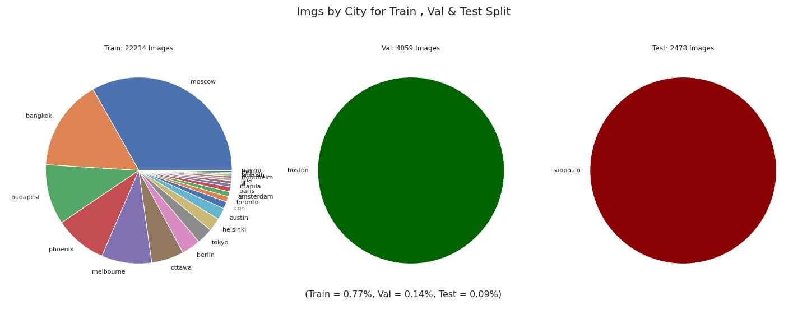

# Day/Night Detection of SVI

## Data Set Generation

These are examplary Day and Night Images from the Mapillary Places Dataset:

First of all I deletet every Image, of which Series contains instances of both Day and Night Images. Some examples can be found here:

Then I chose and apropriate split of the Citys for the Validation and Test Data:

Additionally I randomly droped to Daytime images to get a more even Split for training. This was the distribution I then worked with:

For Training I resized the Images to 260 x 260.

The whole dataset for training, validataion & testing can be downloaded from [here.](https://drive.google.com/file/d/1q_aXvtj2RY_V9R5_murlmACs6So1bQxT/view?usp=sharing)

## Model Training

I tried Transferlearning with Mobilenets but they seemed to pick up the artifacts of the data and overfitted. 

Therefore I did settle with an lighter architecture, which can be found [here](night_detection_task/training_notebooks/ND_Traininng_own_cnn.ipynb).

The resulting model was chossen after using keras_tuner to try out many variations. To do so just use tf.keras.models.load_model().

## Results

To get a good judgment of the model performance I manualy relabeled the Test Dataset to ensure correct labels. For transparency the relabeld Dataset can be found [here](night_detection_task/Relabeled_Test_DS). 

On this Dataset the Model achieved an accuracy of 97.62
%.

Some examplary predicitons:

All of the 59 wrongly predicted Images can be found [here](night_detection_task/wrong_labels).

They consist mainly of Nighttime Images with very bright Streetlights. This is also represented in the confusion Matrix: 

## Models

The model can be loaded either [with the inital augmentation block](night_detection_task/final_model) or [without](night_detection_task/final_model_without_aug).

Both models take an Input of 260 x 260.

