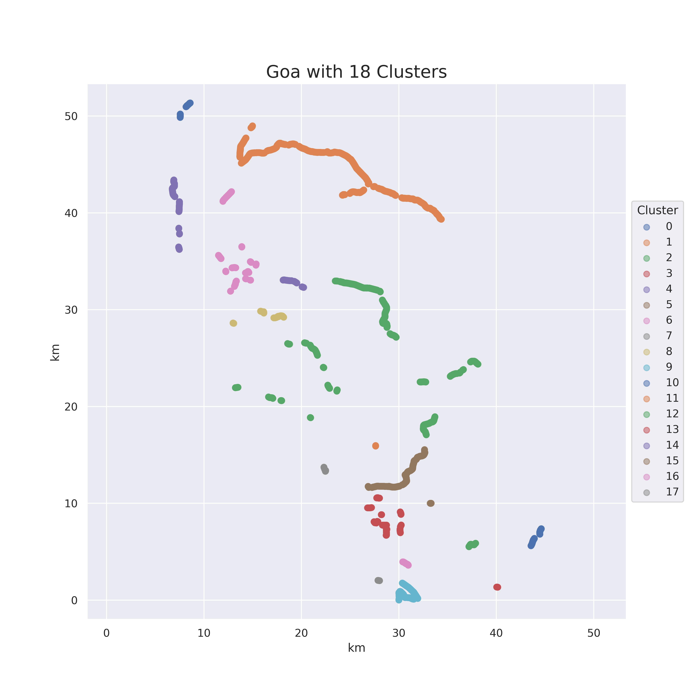

# View Direction Detection

## Data preparation

For this domain i did mainly these two steps of preparing the data.

1. Discard all images with a change of view direction in their sequence. Then discard/cut all seqs with a max distance exceeding 50 meters. Use every second possible subsequence of length 5.

2. Cluster the sequences by location, to enable a better train split. Example for this for Goa:

  

  

3. Use this seqs clusters to choose a sensibel training split:

  

  

  

  

4. Flip 50% of both front and sideways seqs to make the model indifferent of correct temporal order.

5. Clean the Data by training models on it, looking at the sequences with highest loss.

6. Manually relabel test dataset.

## Training

After an extensive model search using the keras_tuner, I settled on this ensemble model:

  
  <figcaption>Ensemble Model Architecture</figcaption>

   

  
  <figcaption>Ensemble Block Architecture</figcaption>

   

The model architecture consists of an ensemble model, consisting of 3 CRNNs with EfficinetB0s with ImageNet weights followed by LSTMs.

## Results

  

   

  

   