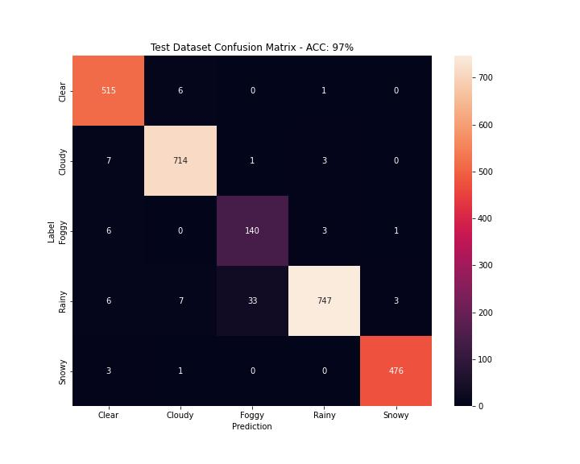

# Weather Image Detection of SVI

## Data Set Generation

For this model we collected the Datasets through various means. 

1. Downloading Mapilarly sequences
2. DAWN Datasets (https://data.mendeley.com/datasets/766ygrbt8y/3)
3. Foggy Cityscapes (https://paperswithcode.com/dataset/foggy-cityscapes)
4. Raidar (https://raidar-dataset.com/)
5. Duckduckgo queries

In total we had 27000 images and split them into train, val ,test datasets. (80/10/10)
For the train & val datasets only human labeleded images were chosen, so not including the Duckduckgo images. 

For Training I resized the Images to 224 x 224.

## Model Training

I tried out Transfer Learning with EfficientNetV2B0 and it worked good enough on the first run.

## Results

The Model achieved 97% Accuracy on the Test Dataset. 

The wrong test predictions can be found [here](../weather/false_predictions/)

 
Confusion Matrix

## Models

The model can be loaded [here](../weather/weather_model_weights) (with the inital augmentation block).

